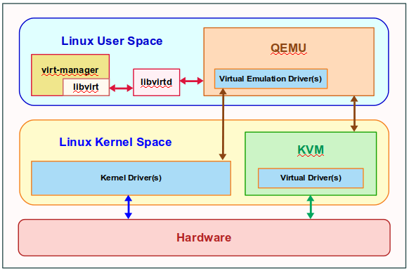

# KVM architecture and installation

## Kiến trúc thông thường

Nếu dùng linux server để cài KMV chúng ta cần 1 phần mềm giao diện để kết nối là *Webvirtcloud*

## Kiến trúc Webvirtcloud kết nối nhiều KVM server

## Installation

1. Cài đặt KMV server và các tools liên quan

2. Cài đặt Webvirtcloud làm interface cho KVM